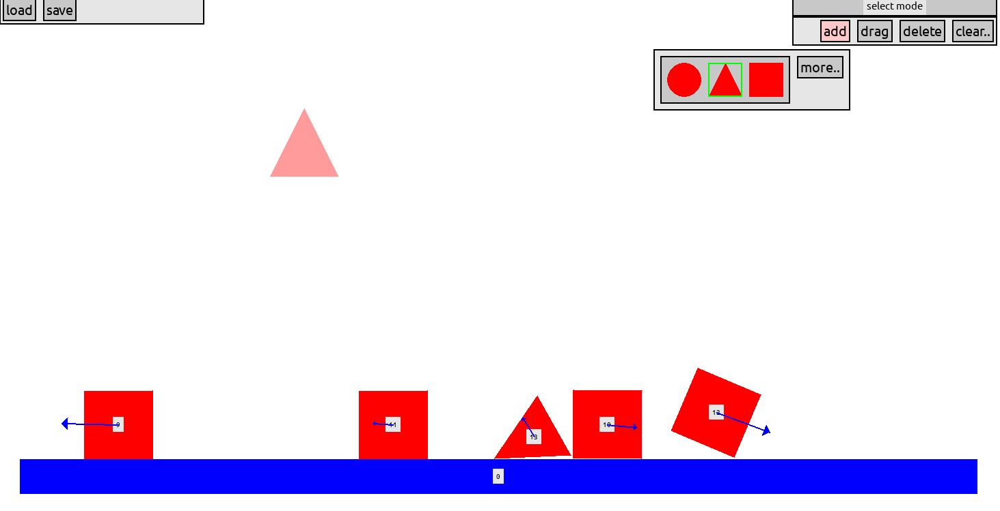

# Interactive physics simulator

## run instructions
- clone the repo
- install requirements (eg.) `pip install -r requirements.txt`
- run `controller.py`, (eg.) `python src/controller.py` (in root directory)

## current features
- realistic rigid body collusions
- movement culling when velocity is too slow
- drag state (where user can drag and throw objects)

## work in progress
- friction
- loading and saving worlds